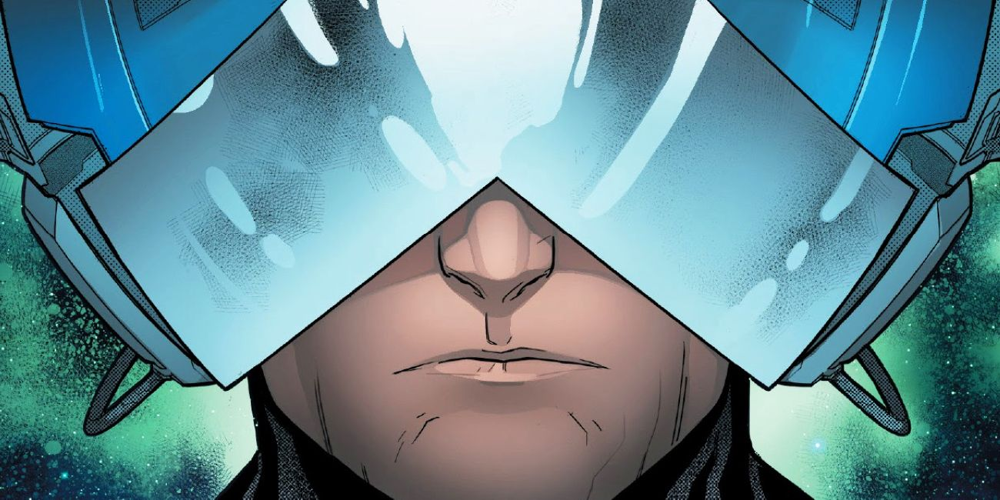

<p align="center">
  
</p>

# Cerebro

*A real-time DPS meter for Marvel Heroes (Tahiti / MHServerEmu builds).*

Standalone WPF app with a full main window plus optional always-on-top
overlays for DPS, buffs, and ability cooldowns. Displays live DPS, boss-fight
breakdowns, party leaderboard, ability contribution, fight history, personal
bests, an Eternity Splinter cooldown tracker, a WeakAuras-style buff watchlist,
and a Cooldown Tracker that knows when your abilities are actually back up
(server-authoritative, CDR-aware). Updates itself in place via a one-click
in-app updater. Runs as its own process — no patching, no DLL injection, no
game-side hooks — by passively sniffing the client's TCP/4306 traffic with Npcap.

```
┌───────────────────────────────┐
│  BOSS DPS - Blade             │
│           2.14M               │
│  Max hit: 487k                │
│  live · Fight: 27.3M          │
│ ─────────────────────────────│
│ ▶ Blade  (ace42)   2.14M 100%│
│   Storm  (xguy)    1.32M  62%│
│   Rogue  (ace99)    879k  41%│
├ ── Boss Fight ───────────────┤
│           1.87M               │
│  live · Fight: 24.1M          │
│ ─────────────────────────────│
│ ▶ Blade             100%     │
│   Storm              61%     │
├ ── My Abilities ─────────────┤
│  Vorpal Slash   891k avg 42% │
│  Charge         512k avg 24% │
│  Bloodbath      309k avg 14% │
└───────────────────────────────┘
```

Both views drive off the same meter — toggling the overlay on/off via the
header checkbox in the main window doesn't reset any stats. Right-click either
the overlay or any of the dashboard rows for context menus; the main-window
**Settings** tab is the canonical home for all persisted toggles. All settings
persist across restarts.

---

## Features

### Live DPS

- **Real-time DPS** computed over a rolling 60-second window, with instant
  live rate during active damage and smooth 60s-average fallback when idle.
- **Active-time DPS** — boss-fight rate is computed over `(fight_end − owner_first_hit)`
  rather than wall-clock time, so a 3-second 50M opener doesn't get diluted by
  the dead time before you started swinging.
- **Max single-hit** tracked at three scopes simultaneously — `fight`,
  `session`, and `all-time record` — and shown in the main dashboard's
  summary card.
- **Boss / target name** resolved from the engaged boss's prototype index
  against a generated table of 1115 names (extracted from `BossPrototypes`),
  so report labels read like *"Doctor Doom — Blade"* instead of *"Boss Fight"*.

### Main app + three overlays

Cerebro starts as a normal tabbed app window with **Live / Reports / Settings /
Cosmic Loot Scanner / Buff Tracker / Cooldown Tracker / Diagnostics** tabs.
Three independent always-on-top overlays toggle from the compact one-row
header (under the **Overlays:** group label):

| Header toggle | Floating window |
|---|---|
| **DPS** | DPS / leaderboard / boss / power-breakdown / Eternity Splinter — the original compact meter |
| **Buff** | Tracked buffs (chip-strip or WeakAuras free layout — your pick in Buff Tracker tab) |
| **Cooldown** | Tracked ability cooldowns as WeakAuras-style icons (Cooldown Tracker tab) |

Closing any overlay's ✕ just hides it; the main app keeps running. Each
overlay's geometry, lock state, and content are persisted independently.

**Click-through lock** (per overlay). Both the DPS overlay (Settings tab) and
the Buff / Cooldown overlays (Buff Tracker / Cooldown Tracker tabs) have a
"Lock overlay (click-through)" toggle. Locked = `WS_EX_TRANSPARENT`, the game
gets all mouse input even though the overlay paints over it. Unlocked =
mouse-interactive so you can drag, resize, or right-click. The typical
workflow is *unlock to position, then lock for play*.

**Persist when alt-tabbed** — separate header checkbox (after a vertical
divider since it's a different concept from the three visibility toggles),
off by default. When on, the DPS overlay stays visible even when Marvel
Heroes isn't the foreground window (useful on multi-monitor setups where
the game lives on a different display than the overlay).

**Boss-key hotkey** — `Ctrl+Shift+H` by default. System-wide press that
flips the three visibility checkboxes off at once; press again to bring
them back in exactly the same pattern that was on before (stashed in
memory). The checkboxes always reflect what's actually visible, so the
header is a faithful mirror of the runtime state. Rebind / disable in
Settings.

### Live dashboard

The main window's *Live* tab is the wide-format view, distinct from the
compact overlay pill:

- **Summary card** — hero portrait, current DPS, mode pill (ALL DAMAGE vs
  BOSS DAMAGE ONLY), max-hit at all three scopes, **Save snapshot** button.
- **Eternity Splinter banner** — full-width status row (see below).
- **Leaderboard + My Powers** — side by side, so you can see the party
  ranking *and* your own ability breakdown without scrolling.
- **Boss banner** — appears when a boss fight is active in non-boss-only
  mode, showing the boss-only numbers alongside the all-damage view.

### Party leaderboard

Top 5 heroes ranked by share of session or encounter damage with:
- Hero avatar portrait, hero name, and player nickname
- Live DPS and 60-second total per row
- Proportional bar visualization

### Boss encounter tracking (Boss-Only mode)

Dedicated encounter accumulator that tracks only damage dealt to boss entities:

- Resets automatically on each new boss encounter
- `Fight:` total shows running encounter damage separate from the 60s window
- Leaderboard switches to encounter-share ranking while a boss is alive and
  shows the frozen final breakdown after all bosses die
- Optional second section in the overlay shows boss-fight stats alongside the
  main DPS numbers — useful in non-boss-only mode

### Ability / power breakdown

Bottom section of the overlay shows the top 8 abilities ranked by damage:

- **Avg hit** per ability (total damage ÷ hits), right-sized in the overlay column
- **Total damage** and **% of total**
- Stacked color-coded segment bar above the rows showing relative contribution
- Individual bar behind each row

### Fight history & auto-save

Boss fights are saved automatically when the encounter ends (all bosses dead):

- Rolling cap of **50 auto-saves** — oldest are pruned automatically
- Manual save also available from the right-click menu at any time
- `AUTO` badge distinguishes auto-saves from manual snapshots in the list

### Report viewer

Browse saved fights via the right-click menu → **View fight history**:

**List panel (left)**
- Sort by: newest first · highest DPS · hero A→Z
- Filter by hero (dynamically populated from saved fights)
- `PB` (green) and `AUTO` (orange) badges per row
- Fight duration shown on each list item

**Detail panel (right)**
- Editable fight title — click to rename in-place, Enter to commit, Escape to cancel
- `★ PB` badge in the header when the fight set a personal best
- Mode, hero, DPS, duration, and max-hit stat badges
- **DPS sparkline** — bar chart of DPS sampled every 5 seconds over the fight
- Party leaderboard with DPS · Total · % columns
- Ability breakdown table: ABILITY · HITS · AVG HIT · MAX HIT · TOTAL · %
- **Totals row** below the ability table: combined hits, weighted avg hit, highest
  single hit, and grand total
- **Copy to clipboard** — formats the full fight summary for pasting to Discord
- **Auto-refreshes** when a new fight is auto-saved (FileSystemWatcher + 400 ms debounce)

### Personal bests

- Best DPS per hero is tracked across all sessions in `personal_bests.json`
- Auto-saved fights that beat the previous record are flagged `IsPersonalBest`
- `PB` badge appears in the fight list and `★ PB` badge in the detail header

### Eternity Splinter tracker

Tracks the per-player splinter drop cooldown so you know when killing
another mob has a chance of yielding one:

- **Detection** — listens for the splinter's `EntityCreate` packet on the
  wire and arms a 6-minute countdown the instant a drop lands.
- **In-cooldown suppression** — the server-side throttle is ~7 minutes per
  player, so any second drop "detection" arriving inside the window is
  necessarily a false positive (the proto enum index isn't perfectly
  unique). Cerebro drops these silently with a de-duped diagnostic line so
  the alert only fires for the real drop.
- **Three visual states**:
  - **READY** (blue) — drop is eligible; banner gently pulses (1.0 →
    0.55 → 1.0 opacity, 1.6 s sinusoidal) so peripheral vision catches it
    without a hard flash.
  - **COUNT** (amber) — `mm:ss until next eligible drop`, with a progress
    bar that fills up as the cooldown elapses.
  - **DROPPED!** (orange flash) — 3-second post-drop highlight when the
    server actually drops a splinter.
- **Audio alert** — single toggle, fires on BOTH the drop moment ("go grab
  it") AND when the cooldown expires ("next drop is eligible"). Routes
  through the same helper for both events; the cooldown window is long
  enough they never overlap.
- **Custom sound file** — point Settings → *Browse* at any `.wav` / `.mp3`
  / `.wma` / `.aac` file your system can decode. Falls back to the
  Windows notification sound if no path is set, the file is missing, or
  playback throws (with a one-line diagnostic in the log explaining
  which).
- **Volume slider** — 0–100 % applied to the custom-file playback;
  the system fallback follows your Windows notification volume instead.
- **Recovery buttons** — Settings → *Reset Splinter cooldown* clears the
  gate (use after a relog / zone change where the server-side timer was
  reset); *Arm Splinter cooldown now* starts a fresh 6-minute countdown
  from this moment (use if you saw a drop in-game that the meter missed,
  e.g. it dropped before you launched Cerebro).

### Cosmic Loot Scanner

A dedicated tab for **hunt mode** — when a drop matches a user-defined affix
shopping list, the diagnostic log fires a special `*** HUNT MATCH ***` line
and (optionally) plays an alert sound, so you notice the gear while it's still
on the ground.

- **Curated affix checklist** — pick from 25 grouped affixes (Offensive,
  Defensive, Sustain, Mobility, Attributes, Specialized) with tooltips
  describing each stat. No hardcoding required; tick / untick on the fly and
  changes save instantly.
- **Minimum-hits threshold** — slider 1–6 controlling how many distinct
  selected affixes a roll has to land for the alert to fire. 2–3 catches
  "good enough" gear; 5–6 only triggers on near-perfect rolls.
- **Rarity gate** — *Any rarity* or *Cosmic only (endgame)* radio. Cosmic-only
  is the default since that's the tier most users hunt.
- **Self filter** — *Only items for my current hero* checkbox. Matches the
  drop's `EquippableBy` field against the local avatar's prototype, so you
  don't get alerts for gear you couldn't equip anyway. Turn it off to see
  hunt matches for any hero (useful when shopping trades / collecting alts).
- **Server-agnostic matching** — the self filter compares avatar prototype
  indices from the same runtime, so server-merge-style enum reshuffles
  don't break the "is this for MY hero" filter.
- **Alert sound** — toggle, custom WAV/MP3/WMA/AAC file path, and volume
  slider. Reuses the same sound-player infrastructure as the splinter
  cooldown, falls back to the Windows asterisk when no file is set.
- **Master enable** — top-level checkbox to silence hunt alerts entirely
  without clearing your affix selections.

Configuration persists to
`%LocalAppData%\MarvelHeroesComporator\loot-hunt-config.json` and is re-read
on every drop, so changes take effect without a restart.

### Buff Tracker

WeakAuras-style watchlist UI for buffs and procs. Discover what's firing on
you live, pick the ones you want to see, and they'll appear on the floating
**Buff Overlay** in your preferred layout.

- **Discovery** — three lists: *Watchlist* (your picks), *Currently active*
  (real-time snapshot of every condition on you), *Recently seen* (history
  of buffs that have fired this session). Click `+ Track` on any row to
  promote it to the watchlist.
- **Per-buff icon** — `Browse…` picks from ~2,300 bundled in-game power
  icons (extracted from `ICO__MarvelUIIcons_SF.upk` + `Talents_SF.upk`);
  `Custom file…` lets you pick any image on disk. Auto-suggests the
  source-power's icon when you first Track a buff.
- **Per-buff alias** — click the name in a watchlist row to rename for
  display. "Teleport Stealth Combo" → "Stealth", etc. The original short
  name stays as the underlying tracking key.
- **Two render modes** for the floating overlay:
  - **Chip strip** (default). Tracked buffs flow as a horizontal strip in
    a styled card. Drag the body to move; resize via edge / corner.
  - **WeakAuras free layout**. Each tracked buff renders as a bare icon at
    a user-positioned (X, Y), sized to a user-configurable square. Drag
    icons anywhere on screen, resize via the corner grip. Unlock the
    overlay to enter edit mode (icons show a yellow border + resize grip);
    lock for play (click-through, game gets all input).
- **Derived state pill** — opt-in. Surfaces "Stealthed / Invisible /
  Stealthed + Invisible" above the strip whenever an active condition
  applies `PropertyEnum` 899 / 993 deltas (Nightcrawler's Surprise Attack
  visibility-gated talents, etc.).
- **Event-driven updates** — `BuffTracker.BuffChanged` fires the instant a
  condition is added or removed, so short-window buffs (1.5 s Bamf stealth
  etc.) flash up reliably instead of being missed by the 4 Hz periodic
  poll.

Watchlist persists to
`%LocalAppData%\MarvelHeroesComporator\buff-watchlist.json` (icons, aliases,
free-layout positions, lock state, all in one file).

### Cooldown Tracker

WeakAuras-style ability-cooldown HUD. **Server-authoritative**: cooldowns
come from `NetMessageSetProperty` deltas pushed by the server, so
**cooldown-reduction (CDR) procs that shorten the cooldown mid-fight are
picked up automatically** — no manual configuration required.

- **Setup**: fire each ability you want to track at least once. The first
  cast lets Cerebro empirically learn the property signature for that
  power (MH 2.16's enum indices have shifted from the static table, so
  signature learning replaces hardcoded enum matching). Click `+ Track`
  on the row that appears in *Recently fired*.
- **Multi-charge abilities** (Bamf Bomb, Nightcrawler Teleport, etc.)
  learn after **two** casts via multi-cast decrement detection. The chip
  shows a yellow `xN` corner badge with the current charge count and
  stays lit while charges > 0 (cooldown becomes the next-charge regen
  timer rather than the cast gate).
- **WeakAuras-style visuals** — icon at 100 % opacity when ready; dimmed
  with a fill-from-bottom cooldown sweep + countdown text while on
  cooldown; lights back up the moment the server clears the property.
- **Click-through lock + free-layout positioning** — same UX as the buff
  overlay. Unlock to drag/resize icons into place, lock for play.
- **Per-power icon override** — `Browse…` picks from the bundled in-game
  icon pack the buff tracker uses.

Watchlist persists to
`%LocalAppData%\MarvelHeroesComporator\cooldown-watchlist.json`.

### In-app updater

Cerebro checks GitHub for new releases at startup (and on demand from
**Settings → Check for updates**). When a newer version is available, a
banner appears at the top of the main window with a one-click **Update
now** button:

1. Probes the install folder for writeability — fails fast if Cerebro
   lives in a read-only path (Program Files without admin, etc.).
2. Downloads the release zip with a live progress bar.
3. Verifies SHA-256 against GitHub's published digest. Mismatch aborts.
4. Extracts the new `Cerebro.exe` to a temp folder.
5. Writes a tiny PowerShell bootstrap that waits for Cerebro to exit,
   renames the current EXE to `.old` (so a partial-swap failure rolls
   back), moves the new EXE into place, relaunches Cerebro, and
   self-cleans.

On failure the banner shows `Update failed: <reason>` and reveals an
**Open release page** fallback button so the manual path is always one
click away. The bootstrap logs to `%TEMP%\cerebro-update-*.log` for
postmortem.

### Diagnostics tab

A live, filterable log viewer that tails `dps-meter.log` on disk:

- **Auto-tail** — follows new lines as they're written, bounded memory.
- **Filter / search** — narrow by substring without touching the file.
- **Copy** — selected rows go to the clipboard formatted for Discord.
- **Open log folder** — jump to the log file in Explorer for archiving.

Useful for triaging "why didn't this drop trigger HUNT MATCH" without alt-tabbing
to Explorer or tailing the file by hand.

### Settings tab

A proper tabbed Settings surface in the main app consolidates all the
right-click-menu toggles into one place:

- **Display** — boss-only mode, boss section toggle, power breakdown
  toggle, buff panels toggle, Eternity Splinter tracker toggle, splinter
  sound + path + volume.
- **Overlay** — Show DPS summary in overlay, Lock overlay (click-through
  for the DPS overlay), overlay scale (25 % to 200 %).
- **Hotkeys** — Global "I got a splinter" hotkey (rebindable, default
  `Ctrl+Shift+E`); global "Hide all overlays" boss-key (rebindable, default
  `Ctrl+Shift+H`).
- **Actions** — Clear DPS, Reset hero max-hit record, Reset / Arm Splinter
  cooldown, Test Splinter sound (plays the actual configured sound, not
  a stand-in).
- **Updates** — Check for updates button (manually re-queries GitHub).
  The startup auto-check still runs in the background.
- **Diagnostics** — toggle the verbose log on/off, Open log folder button.
- **About** — Cerebro version, settings-file location, **View changelog**
  button (opens the bundled `CHANGELOG.md` in a scrollable window).

### Overlay scale

Scale the DPS overlay from 25 % to 200 % via the right-click menu or the
Settings tab's *Scale* slider (25 / 50 / 75 / 100 / 125 / 150 / 175 /
200 %). Dragging the slider **applies live** — the overlay resizes in
real time as you drag. Scale persists across restarts.

---

## Requirements

- **Windows 10 (1809+) or Windows 11** — uses PerMonitorV2 DPI awareness
- **[.NET 8 Desktop Runtime](https://dotnet.microsoft.com/download/dotnet/8.0)** for end users running prebuilt binaries
- **[.NET 8 SDK](https://dotnet.microsoft.com/download/dotnet/8.0)** for building from source
- **[Npcap](https://npcap.com/)** — install with the *"WinPcap API-compatible mode"* checkbox; loopback support is required if the game and server run on the same machine

## Build

```powershell
dotnet build MarvelHeroes.DpsMeter.sln -c Release
```

`Cerebro.exe` lands in `MarvelHeroes.DpsMeter/bin/Release/net8.0-windows10.0.19041.0/`.
(The folder / solution / project / namespace are all still called
`MarvelHeroes.DpsMeter` — those are stable internal identifiers — but the
output assembly is renamed to `Cerebro` via `<AssemblyName>` so the EXE on the
taskbar / Task Manager / Explorer reads as Cerebro.exe.)

## Publish a portable build

The repeatable way (recommended) — wraps `dotnet publish` with the exact flags
that produce the shippable zip, scans the EXE for personal-info patterns, and
drops `publish/Cerebro-vX.Y.zip` next to a `README.txt` for the recipient:

```powershell
.\scripts\publish.ps1 -Version 1.8
```

Manual:

```powershell
dotnet publish MarvelHeroes.DpsMeter/MarvelHeroes.DpsMeter.csproj -c Release    # framework-dependent (small, requires .NET 8 on target)
dotnet publish MarvelHeroes.DpsMeter/MarvelHeroes.DpsMeter.csproj -c Release -r win-x64 --self-contained -p:PublishSingleFile=true  # self-contained single-file (~77 MB, no runtime needed)
```

## Run

```powershell
dotnet run --project MarvelHeroes.DpsMeter/MarvelHeroes.DpsMeter.csproj
```

Start Cerebro **before** logging into the game so the sniffer captures
the initial `EntityCreate` burst. If you start mid-region the meter still
works — it has fallback heuristics — but nicknames may take longer to
resolve until peers move within AOI.

## App icon

`MarvelHeroes.DpsMeter/AppIcon.ico` is generated by
`scripts/generate_appicon.ps1`. The script renders an orange lightning bolt
on a dark rounded tile at every standard icon size (16 / 24 / 32 / 48 / 64 /
128 / 256) and packs them into a single PNG-in-ICO container. Re-run it to
regenerate after tweaking the colours / polygon coords in the script:

```powershell
.\scripts\generate_appicon.ps1
```

Output is deterministic — re-running on a fresh checkout produces byte-identical
bytes, so the `.ico` in the repo stays stable.

## Repo layout

```
MarvelHeroes.DpsMeter/   WPF app — main window + optional overlay, presenter, hero/boss
│                         tables, power breakdown, fight history, report viewer, splinter
│                         tracker, costume PNGs, app icon
│  AppIcon.ico            Generated icon (see scripts/generate_appicon.ps1)
│  Controls/              DpsDisplayPanel (compact overlay), LiveDashboardPanel (wide
│  │                       main-app dashboard), SettingsPanel, LootScannerPanel
│  │                       (Cosmic Loot Scanner tab), LogViewerPanel (Diagnostics tab)
│  Models/                DpsSnapshot, DpsReportStore, PersonalBestStore
│  Services/              DpsMeter aggregator, DpsOverlayPresenter, EternitySplinterTracker,
│  │                       SplinterCooldownSoundPlayer, BossNames table, settings,
│  │                       LootScannerDiagnostic, HuntCriteria, LootHuntConfig,
│  │                       AffixPatternCatalog, AffixTierCatalog
│  Windows/               MainAppWindow, ReportViewerWindow, DpsLiveWindow (legacy mode)
│  DpsOverlayWindow.xaml  The compact floating overlay
NetworkSniffer/          PCAP capture, TCP reassembly, mux demux, NetMessagePowerResult /
                          NetMessageEntityCreate / NetMessageLootEntity parsing
Gazillion/               Marvel Heroes protobuf wire schema (sourced from MHServerEmu)
lib/                     Vendored Google.ProtocolBuffers.dll (proto2-era C# port required by Gazillion)
scripts/                 publish.ps1 (release zip builder), generate_appicon.ps1 (icon),
                          GenerateBossNames.ps1 (boss-name table generator), PackageReadme.txt
docs/                    Banner image and other repo media
```

## Persistence

All per-user state lives under `%LocalAppData%\MarvelHeroesComporator\`:

| Path | Purpose |
|---|---|
| `dps-overlay.json` | DPS overlay window position + scale, mode (overlay/window), boss-only mode, persist-overlay, lock-overlay, splinter cooldown timestamp + sound config, splinter hotkey config, boss-key hotkey config, in-app updater dismissed version, Show overlay / buff / cooldown header checkbox states |
| `buff-watchlist.json` | Buff Tracker config — tracked buff names, icon paths, aliases, free-layout positions, lock state |
| `cooldown-watchlist.json` | Cooldown Tracker config — tracked power proto IDs, icon paths, aliases, free-layout positions, lock state |
| `dps-max-hits.json` | Personal-best single hit per hero (sniffer-level) |
| `dps-player-index.json` | Learned dbId → nickname / current-hero map |
| `personal_bests.json` | Best DPS per hero across all sessions |
| `loot-hunt-config.json` | Cosmic Loot Scanner config — wanted affixes, min hits, rarity gate, self filter, alert sound |
| `reports/dps-*.json` | Individual fight snapshots (auto + manual saves) |
| `dps-meter.log` | Diagnostic log (sniffer + meter + presenter, loot scanner, hunt matches) |

The folder name is intentionally shared with the upstream comporator app
so a user upgrading from the integrated overlay keeps their records.

## Acknowledgments / Provenance

Cerebro stands on a stack of generous upstream work:

- **[wmascent/MarvelHeroesOmega.DpsMeter](https://github.com/wmascent/MarvelHeroesOmega.DpsMeter)**
  is the original DPS meter this project was forked from. The packet-sniffing
  approach, the protobuf parsing skeleton, the encounter-scoped leaderboard,
  the `MarvelHeroesComporator.NetworkSniffer` core, and the "passive TCP/4306
  observation, no game hooks" architecture all come from there. Many of the
  files under `NetworkSniffer/` retain the original `MarvelHeroesComporator`
  namespace verbatim so improvements can be cross-pollinated back to upstream.
- **[Crypto137/MHServerEmu](https://github.com/Crypto137/MHServerEmu)**
  provides the `Gazillion/` protobuf definitions and the `lib/` payloads
  vendored from `EmuSource`. Without the reverse-engineering work in MHServerEmu
  there would be nothing to point a packet sniffer at.
- **Marvel Heroes** itself, the game by Gazillion Entertainment (2013–2017),
  which a community continues to keep alive on private servers. Cerebro is a
  tribute to that community.

Cerebro is a third-party tool. It does not modify, patch, inject into, or
otherwise interact with the game client — it only observes the same network
traffic the OS already routes to your machine.

## License

See `lib/Google.ProtocolBuffers.License` for the bundled protobuf DLL.
The rest of the source is unlicensed pending decision — please ask before
redistributing.
